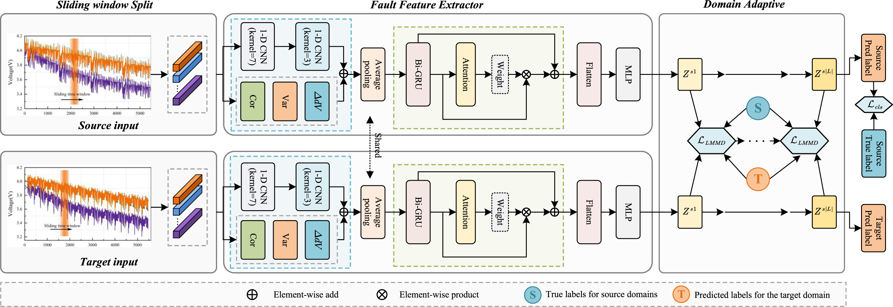

# Battery fault diagnosis research

## Links to papers

- https://www.sciencedirect.com/science/article/pii/S2352152X24024514#fig6

## Highlights

- First to use sub-domain granular info for multi-fault lithium battery diagnosis.
- Innovative multi-level feature processing with attention-guided Bi-GRU.
- Verified under three conditions, diagnostic accuracy is significantly enhanced.

## License 

This project is licensed under the MIT License. See the [LICENSE](LICENSE.txt) file for details.